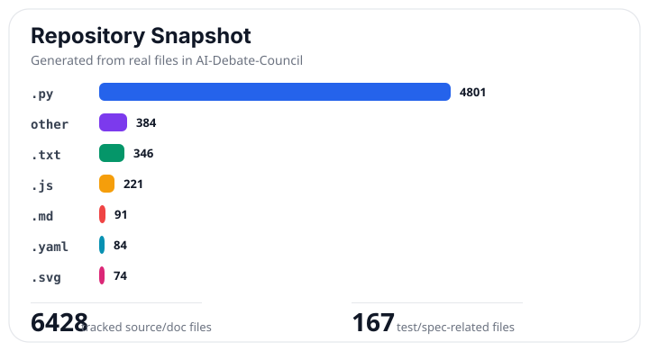
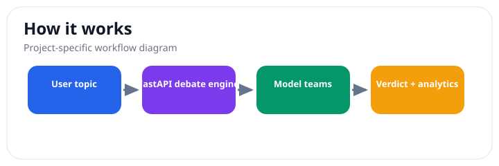

# AI Debate Council - Desktop App

> Status: beta multi-agent debate app. It can help compare arguments and evidence, but it should not be treated as an authority on factual, legal, medical, or financial decisions.

AI Debate Council lets model teams argue opposing sides, challenge claims, track evidence, and produce judged verdicts with analytics. It is useful for exploring tradeoffs, stress-testing ideas, and practicing debate.

## Why Use AI Debate Council?

- Forces competing arguments instead of a single agreeable answer.
- Tracks claims, challenges, evidence, and verdict reasoning across a debate.
- Supports AI-vs-AI exploration and AI-vs-human debate practice.
- Shows analytics and long-term debate memory instead of only a transcript.

## Current Limitations

- Model debates can still hallucinate or overweight weak evidence.
- Verdicts are structured opinions, not proof.
- Costs, latency, and quality depend on the selected model providers.

> **This is the `master-app-interface` branch** — the Electron desktop application (macOS `.dmg` / Windows `.exe`). For the web version that runs in your browser, see the [`master-website-interface`](https://github.com/Evan1108-Coder/AI-Debate-Council/tree/master-website-interface) branch.

The backend is Python 3.13, FastAPI, SQLite, WebSockets, and LiteLLM. The frontend is Next.js, React, TypeScript, and Tailwind CSS. The desktop shell is Electron.

## Quick Start

```bash
git clone https://github.com/Evan1108-Coder/AI-Debate-Council.git
cd AI-Debate-Council
git checkout master-app-interface
python3.13 -m venv .venv
source .venv/bin/activate
pip install -r backend/requirements.txt
cd frontend && npm install && cd ..
cp .env.example .env
# Edit .env with at least one AI provider key
```

For desktop installers, use the [Releases page](https://github.com/Evan1108-Coder/AI-Debate-Council/releases). The deeper setup notes remain in [SETUP.md](SETUP.md).

## Screenshots

Note: screenshot values are placeholders for demonstration, not claims or factual debate results.

### AI vs AI Debate — Judge Verdict and Cost Tracking


### Graphs & Statistics — Debate Analytics Dashboard


### Debate Intelligence — Claims, Challenges, and Verdict Review


### AI Debater Experiences — Global Memory Layer


### User Debate Profile — Training Dashboard


### Council Settings and Dark Mode


## Architecture


*Three-layer architecture: Next.js client communicates over HTTP and WebSockets with a FastAPI server backed by SQLite, while a LiteLLM router dispatches LLM calls to five AI providers.*


*End-to-end flow from topic entry through setup, multi-round debate with four specialist roles per team, real-time WebSocket streaming, analytics-weighted judgment, and post-debate intelligence.*

## Features

- **Pro and Con teams** with 1-4 debaters per team across four roles (Advocate, Rebuttal Critic, Evidence Researcher, Cross-Examiner)
- **Professional phase flow** -- constructive, cross-examination, evidence, rebuttal, discussion, closing, audit, and verdict
- **Judge AI verdict** with optional multi-judge panel (3 or 5) and analytics-weighted scoring
- **AI vs Human Debate Training** -- practice mode with AI opponent, Debate Trainer coaching, and persistent user profile
- **Council Assistant** -- dual-mode chat that classifies messages as debate or conversation
- **21 models across 6 providers** -- OpenAI, Anthropic, Google, Groq, MiniMax, Moonshot
- **10-method analytics engine** -- Bayesian inference, argument mining, game theory, ELO credibility, and more
- **Real-time charts** -- Bayesian pie chart, role weight bars, stance votes, trend lines, phase timeline
- **Cost tracking** -- per-debate and per-turn estimates in 9 currencies with live OpenRouter pricing
- **Dark mode** -- Light, Dark, and System theme options
- **Desktop app** -- Electron wrapper with invisible background processes, no terminal needed

## Supported Models

Add only provider API keys to `.env` -- no model names needed. The app auto-detects available models.

| Provider | API Key Variable | Models |
| --- | --- | --- |
| OpenAI | `OPENAI_API_KEY` | gpt-5.4-pro, gpt-5.4-mini, gpt-4o, gpt-4o-mini |
| Anthropic | `ANTHROPIC_API_KEY` | claude-opus-4-6, claude-sonnet-4-6, claude-haiku-4-5, claude-3.5-sonnet |
| Google | `GOOGLE_API_KEY` | gemini-3.1-pro, gemini-3-flash, gemini-2.5-flash-lite |
| Llama via Groq | `GROQ_API_KEY` | llama-4-maverick, llama-4-scout, llama-3.3-70b |
| MiniMax | `MINIMAX_API_KEY` | minimax-m2.7, minimax-m2.5-lightning |
| Moonshot | `MOONSHOT_API_KEY` | kimi-latest, kimi-k2-thinking, kimi-k2-turbo-preview, kimi-k2.5-vision, moonshot-v1-128k |

## Desktop App (This Branch)

Download pre-built installers from [Releases](https://github.com/Evan1108-Coder/AI-Debate-Council/releases):

| Platform | File |
| --- | --- |
| macOS (Apple Silicon) | `AI Debate Council-1.0.0-arm64.dmg` |
| macOS (Intel) | `AI Debate Council-1.0.0.dmg` |
| Windows | `AI Debate Council Setup 1.0.0.exe` |

Prerequisites: Python 3.13 and Node.js 20+ installed on your system.

### macOS Setup

```bash
cd /Applications/AI\ Debate\ Council.app/Contents/Resources/app-content
python3.13 -m venv .venv
source .venv/bin/activate
pip install -r backend/requirements.txt
cd frontend && npm install && cd ..
cp .env.example .env
# Edit .env to add at least one provider API key
```

### Building from Source

```bash
git clone https://github.com/Evan1108-Coder/AI-Debate-Council.git
cd AI-Debate-Council
git checkout master-app-interface
python3.13 -m venv .venv && source .venv/bin/activate
pip install -r backend/requirements.txt
cd frontend && npm install && npx next build && cd ..
cd electron && npm install
npm run build:mac    # macOS .dmg
npm run build:win    # Windows .exe
```

## Quick Start (Web Version)

For the web version, switch to the `master-website-interface` branch. See [SETUP.md](SETUP.md) for detailed instructions.

```bash
python3.13 -m venv .venv
source .venv/bin/activate
pip install -r backend/requirements.txt
cp .env.example .env
# Edit .env to add at least one provider API key
.venv/bin/python dev.py
```

Open `http://localhost:6001`.

## Running Tests

```bash
python3.13 -m unittest discover -s backend/tests -v
```

Tests use mock mode and do not require API keys.

## Reference Docs

| Topic | Document |
| --- | --- |
| API endpoints (REST) | [docs/API_REFERENCE.md](docs/API_REFERENCE.md) |
| WebSocket protocol | [docs/WEBSOCKET_PROTOCOL.md](docs/WEBSOCKET_PROTOCOL.md) |
| Team roles and debate flow | [docs/TEAM_ROLES.md](docs/TEAM_ROLES.md) |
| Debate intelligence and analytics | [docs/DEBATE_INTELLIGENCE.md](docs/DEBATE_INTELLIGENCE.md) |
| Chat settings reference | [docs/CHAT_SETTINGS.md](docs/CHAT_SETTINGS.md) |
| Project structure | [docs/PROJECT_STRUCTURE.md](docs/PROJECT_STRUCTURE.md) |
| Setup guide | [SETUP.md](SETUP.md) |
| Environment variables | [ENVREADME.md](ENVREADME.md) |
| Troubleshooting | [TROUBLESHOOTING.md](TROUBLESHOOTING.md) |

## Branches

| Branch | Description |
| --- | --- |
| `master-website-interface` | Web application -- run in browser via `dev.py` |
| `master-app-interface` | Desktop application -- Electron wrapper for macOS and Windows |

## License

MIT License -- see [LICENSE](LICENSE)

## Real Visual Snapshot

These visuals are generated from the actual repository structure and project workflow, not placeholders.




