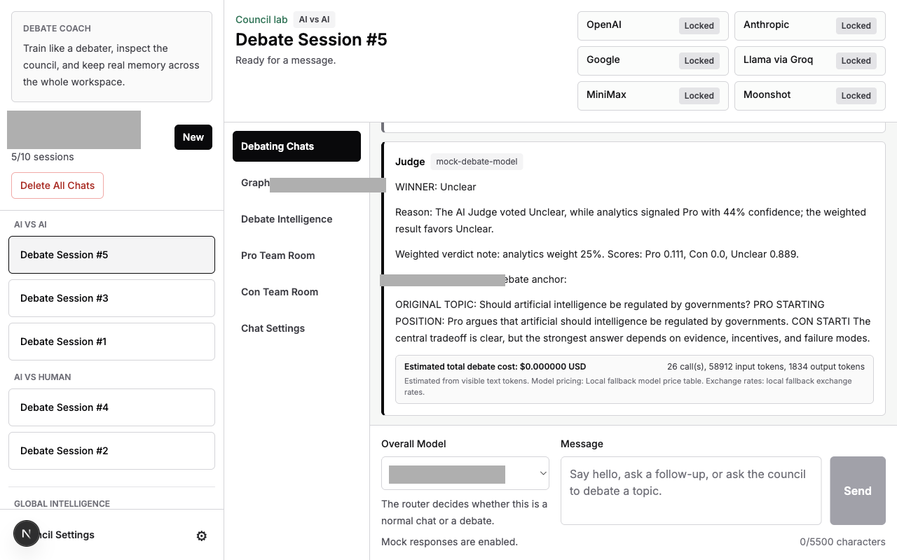
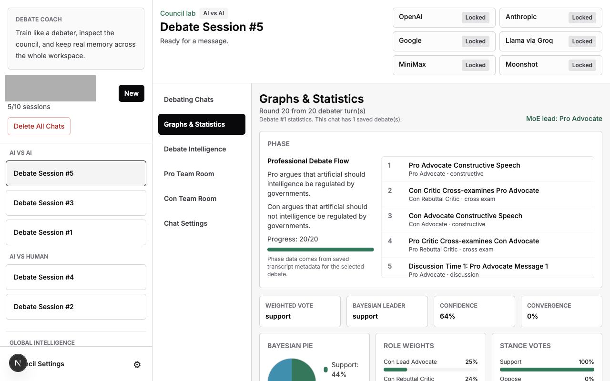
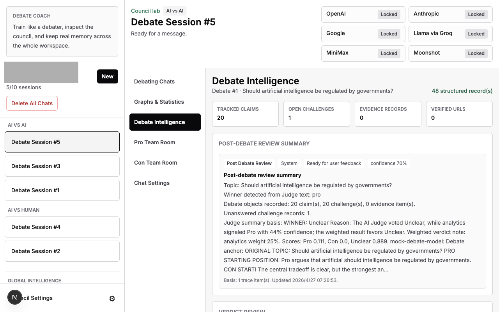
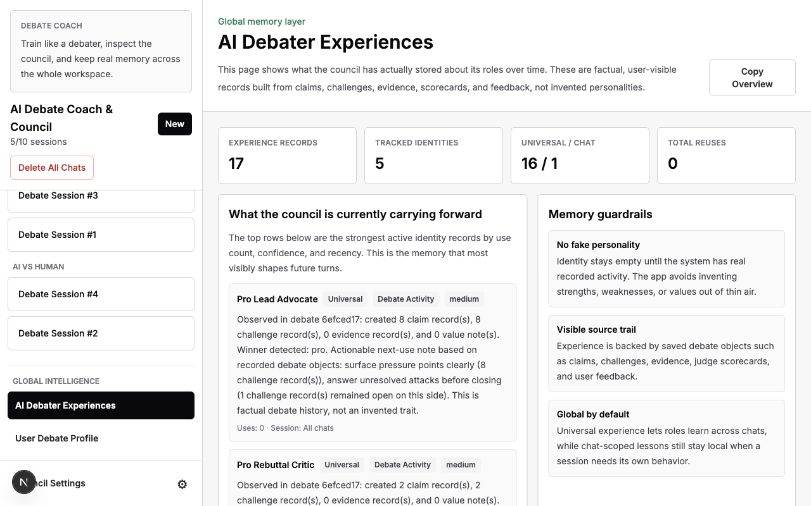
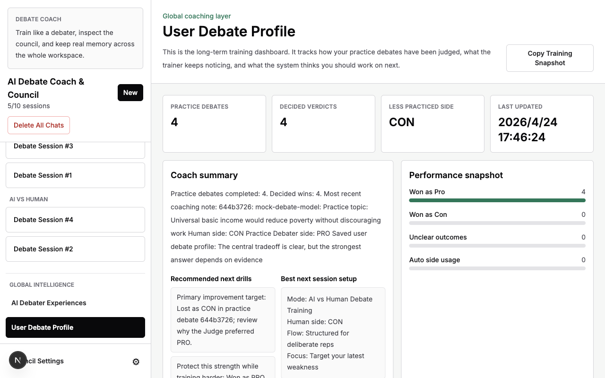
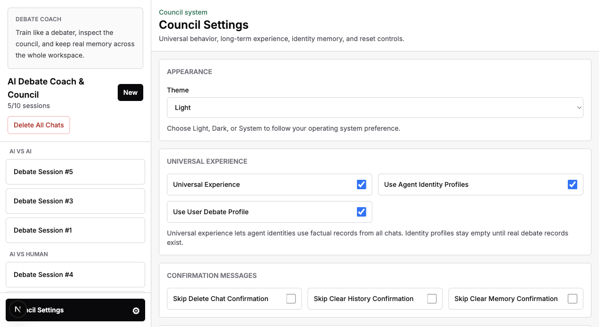
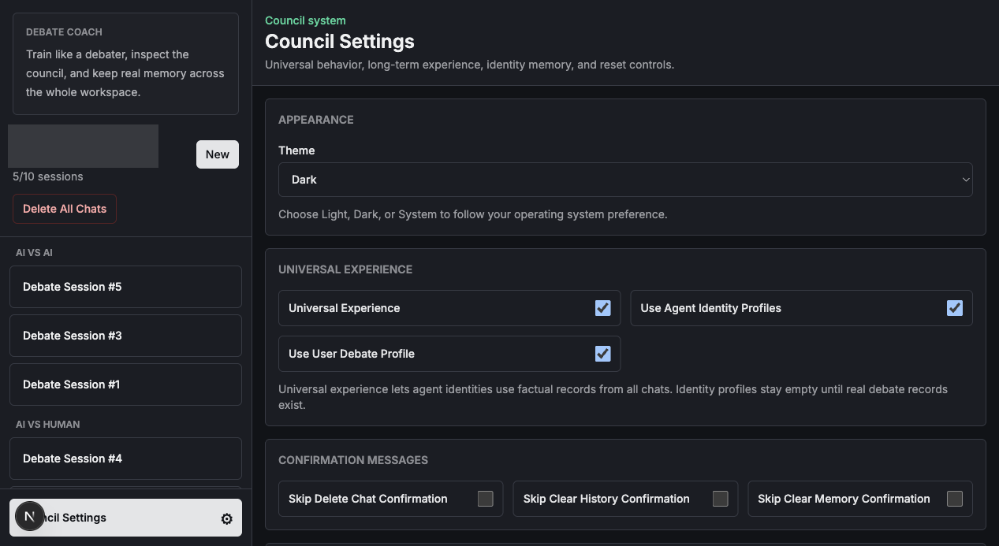
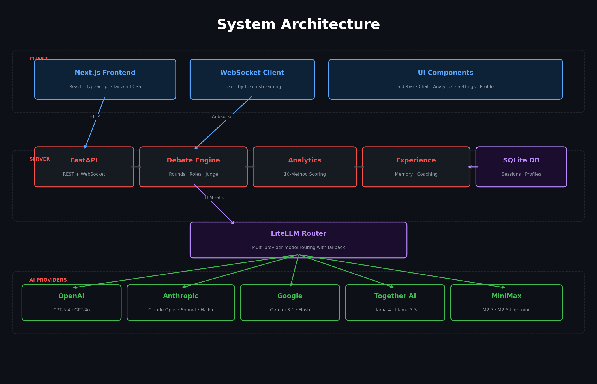
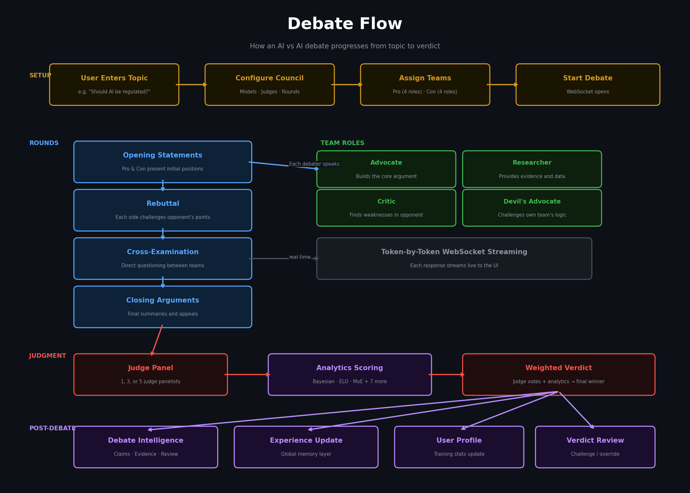

# AI Debate Council - Desktop App

> Status: beta multi-agent debate app. It can help compare arguments and evidence, but it should not be treated as an authority on factual, legal, medical, or financial decisions.

AI Debate Council lets model teams argue opposing sides, challenge claims, track evidence, and produce judged verdicts with analytics. It is useful for exploring tradeoffs, stress-testing ideas, and practicing debate.

## Why Use AI Debate Council?

- Forces competing arguments instead of a single agreeable answer.
- Tracks claims, challenges, evidence, and verdict reasoning across a debate.
- Supports AI-vs-AI exploration and AI-vs-human debate practice.
- Shows analytics and long-term debate memory instead of only a transcript.

## Current Limitations

- Model debates can still hallucinate or overweight weak evidence.
- Verdicts are structured opinions, not proof.
- Costs, latency, and quality depend on the selected model providers.


> **This is the `master-app-interface` branch** — the Electron desktop application (macOS `.dmg` / Windows `.exe`). For the web version that runs in your browser, see the [`master-website-interface`](https://github.com/Evan1108-Coder/AI-Debate-Council/tree/master-website-interface) branch.

AI Debate Council is a multi-AI debate system where two AI teams — Pro and Con — debate any topic you choose in real time, or where you can practice debating directly against an AI opponent. This branch packages the application as a native desktop app using Electron. The app runs like a normal desktop application — it starts the Python backend and Next.js frontend as invisible background processes and displays the UI in a native window. There is no terminal window or console box visible during startup.

The backend is Python 3.13, FastAPI, SQLite, WebSockets, and LiteLLM. The frontend is Next.js, React, TypeScript, and Tailwind CSS. The desktop shell is Electron.

## Screenshots

Note: screenshot values are placeholders for demonstration, not claims or factual debate results.

### AI vs AI Debate — Judge Verdict and Cost Tracking

A completed council debate showing the Judge's verdict with weighted analytics scores, cost estimation, and the message input area.



### Graphs & Statistics — Debate Analytics Dashboard

Phase timeline, voting results, Bayesian analysis, role weights, and debate flow visualization after a completed debate.



### Debate Intelligence — Claims, Challenges, and Verdict Review

Structured records extracted from the debate transcript: tracked claims, open challenges, evidence records, and the post-debate review summary.



### AI Debater Experiences — Global Memory Layer

Long-term memory showing what the council has learned across all debates. Records are factual and backed by saved debate objects.



### User Debate Profile — Training Dashboard

Practice history, coaching summary, performance snapshot, and recommended next drills based on real debate results.



### Council Settings — Appearance and Behavior

Theme selection (Light/Dark/System), universal experience toggles, confirmation preferences, and debate intelligence defaults.



### Dark Mode

Full dark mode support across all panels and pages.



## Diagrams

### System Architecture



*Three-layer architecture: Next.js client communicates over HTTP and WebSockets with a FastAPI server backed by SQLite, while a LiteLLM router dispatches LLM calls to five AI providers.*

### Debate Flow



*End-to-end flow from topic entry through setup, multi-round debate with four specialist roles per team, real-time WebSocket streaming, analytics-weighted judgment, and post-debate intelligence.*

## Table of Contents

- [Features](#features)
- [Architecture Overview](#architecture-overview)
- [Project Structure](#project-structure)
- [Supported Models](#supported-models)
- [Team Roles and Debate Flow](#team-roles-and-debate-flow)
- [Debate Intelligence and Analytics](#debate-intelligence-and-analytics)
- [Chat Settings](#chat-settings)
- [Session and Debate Management](#session-and-debate-management)
- [API Reference](#api-reference)
- [WebSocket Protocol](#websocket-protocol)
- [Desktop App (This Branch)](#desktop-app-this-branch)
- [Quick Start (Web Version)](#quick-start-web-version)
- [Running Tests](#running-tests)
- [Development Notes](#development-notes)
- [Branches](#branches)
- [Related Documentation](#related-documentation)
- [License](#license)

## Features

### Debate System

- **Pro and Con teams** with 1 to 4 debaters per team, configurable per chat.
- **Four team roles**: Advocate, Rebuttal Critic, Evidence Researcher, and Cross-Examiner. Each role has a distinct system prompt, job description, and default behavior.
- **Professional phase flow**: Debates follow structured constructive, cross-examination, evidence, rebuttal, advocate-led discussion, closing, audit, and verdict phases instead of the old moderator loop.
- **Optional Judge Assistant**: Before the final verdict, a neutral Judge Assistant audits the debate for missed points, unanswered claims, evidence gaps, contradictions, and useful statistics for the Judge.
- **Judge AI verdict**: The Judge receives the full transcript, the Judge Assistant audit, and live analytics, then delivers a structured verdict naming a winner.
- **Optional multi-judge panel**: Chat Settings can switch from 1 Judge to 3 or 5 independent Judge Panelists. Their votes are combined by majority-style scoring.
- **Analytics-weighted verdicts**: The final verdict can give a configurable weight to tracked quantitative signals such as Bayesian stance, claims, challenges, evidence, and scorecard data.
- **Verdict review**: In Debate Intelligence, the user can challenge the verdict or override the saved winner for future charts without rewriting the original Judge transcript.
- **Maximum 3 active debates** running concurrently across all sessions.

### AI vs Human Debate Training

- **Practice mode**: New chats can be created as AI vs AI Debate or AI vs Human Debate Training. The mode is locked for that chat.
- **Practice Debater**: In training mode, the AI opponent is called Practice Debater and argues against the human.
- **Free or structured practice**: Free mode lets the debate continue until the user ends it. Structured mode uses a chosen number of rounds and turns the last round into a closing appeal.
- **Debate Trainer**: After the Judge verdict, a Debate Trainer reviews the user's performance, style, strengths, weaknesses, and next improvement targets.
- **User Debate Profile**: The app stores a lightweight debate profile from practice results so future training can adapt without inventing false experience.
- **Global training dashboard**: The sidebar includes **User Debate Profile** and **AI Debater Experiences** so the long-term coaching loop and AI identity memory are visible across all chats.

### Chat and Council Assistant

- **Dual-mode interaction**: The system automatically classifies each message as "debate" or "chat" using an LLM intent classifier with heuristic fallback. Debate-like messages trigger the full council; normal messages go to the Council Assistant.
- **Council Assistant**: A single chat agent that answers follow-up questions, explains past debate results, and handles non-debate conversations using the session's message history as memory.
- **Always On mode**: Optionally force all messages through the Council Assistant, bypassing the intent classifier.
- **Training-first onboarding**: New sessions open with AI vs Human training selected by default, while AI vs AI remains the council lab mode for observation and analysis.

### Model Support

- **21 models across 6 providers**: OpenAI, Anthropic, Google, Groq (Llama), MiniMax, and Moonshot.
- **Automatic model detection**: Add a direct provider API key to `.env` and all models from that provider appear in the dropdown. No model names go in `.env`.
- **Per-agent model overrides**: Each role (Advocate, Rebuttal Critic, etc.) can use a different model, or fall back to the session's Overall Model.
- **Mock mode**: Set `MOCK_LLM_RESPONSES=true` to test the full UI flow without real API calls.

### Analytics and Intelligence

- **10-method debate intelligence panel** built into the Graphs & Statistics tab: ensemble voting, Bayesian inference, argument mining, game theory, argument graphs, attention mechanisms, confidence calibration, Delphi convergence, Mixture of Experts, and ELO-style credibility scoring.
- **Real-time analytics updates** streamed after each debater turn.
- **Visual charts**: Bayesian pie chart, role weight bars, stance vote bars, Bayesian trend line chart, and argument mining details.
- **Per-debate statistics**: Switch between saved debates in the stats panel.
- **Session-level charts**: Win Rate by Team, Cost Breakdown by Phase, Debate Duration, Messages per Role, and a Citation Box that collects URLs cited by Evidence Researchers.
- **Phase timeline**: The stats panel shows a visual phase progress bar with the current phase highlighted and completed/total counts.

### Cost Tracking

- **Estimated API cost per debate**: The backend tracks token usage for every model call and estimates costs using live OpenRouter pricing when a supported model can be matched there, with a local fallback table when live pricing is unavailable.
- **9 currencies**: USD, CNY, HKD, EUR, JPY, GBP, AUD, CAD, SGD. Currency is selectable per chat in Chat Settings.
- **Cost summaries**: Council Assistant messages show their own estimated cost. Debate turns store individual `cost_summary` for per-turn analytics, and the Judge message additionally stores a `debate_cost_summary` containing the overall debate total.
- **CostBox display**: When "Show Money Cost" is enabled in Chat Settings, Council Assistant messages display their own estimated cost. In debate mode, the Judge message shows the overall debate cost by default (via `debate_cost_summary`). Turn-by-turn debate costs appear only when "Show Every Message Cost In Debate" is enabled. An optional per-model breakdown is available via "Show Model Costs".
- **Token estimation**: A lightweight heuristic estimates tokens from text (with CJK-aware counting) without requiring a tokenizer library.

### Runtime Diary

- **Structured event log**: The backend maintains an in-memory diary (`runtime_diary.py`) that records events from both the backend and frontend, including WebSocket lifecycle, debate progress, errors, and custom entries.
- **Automatic secret scrubbing**: API keys, tokens, and other secrets are automatically redacted before being stored, using pattern matching for common secret formats.
- **Council Assistant context**: The Council Assistant includes recent diary entries in its prompt, giving it awareness of what happened during the session (errors, reconnections, etc.).
- **Frontend logging**: The frontend posts events to `POST /api/runtime-diary` for actions like WebSocket open/close, errors, and session changes.
- **Capped at 160 entries**: Older entries are automatically evicted to keep memory usage bounded.

### WebSocket Reliability

- **Auto-reconnect**: If the WebSocket connection fails before the server starts responding, the frontend automatically retries up to 2 times with a 1.2-second delay between attempts.
- **Graceful disconnect handling**: The backend uses a `safe_send_json()` helper that catches `WebSocketDisconnect` and `RuntimeError` on closed connections, preventing server crashes when a client disconnects mid-debate.
- **`ClientDisconnectedError`**: The debate engine raises this custom error when it detects a client disconnect, allowing the WebSocket handler to clean up gracefully instead of logging a traceback.

### Input Limits

- **5500-character limit** on user messages. The frontend shows a live character counter, warns at 5000 characters, and blocks sending above 5500.

### Session Management

- **Up to 10 chat sessions** at a time.
- **Default naming**: Sessions increment as `Debate Session #1`, `Debate Session #2`, etc. Deleted numbers are never reused unless every session is deleted, which resets the counter.
- **Rename and delete** sessions and individual debates from Chat Settings.
- **Clear Chat History**: Hides messages and debate graphs while preserving hidden memory for follow-up questions.
- **Clear Chat Memory**: Permanently removes all messages and debates from a session.

### Per-Chat Settings

- Overall Model selection (applies to all roles by default).
- Debaters per team (1–4, default 2).
- Discussion Messages Per Team (1–4, default 3).
- Debate rounds (1–6, default 2) controls the number of advocate-led discussion phases.
- Judge Assistant toggle (on/off, recommended on).
- Judgment Quality: Judge Panel Size (1/3/5), Analytics Weight (0–75%), and Allow Verdict Challenge / Override.
- Per-agent settings: model, temperature (0–1), max tokens (120–2000), response length (Concise/Normal/Detailed), web search toggle for Evidence Researcher, Always On toggle for Council Assistant.
- Debate tone (Academic, Casual, Formal, Aggressive).
- Language (English, Chinese, Cantonese).
- Context window (0–6 rounds of debate history included in prompts).
- Auto-scroll, show timestamps, show token count, show money cost, show every message cost in debate.
- Fact-check mode (reserved for future tool integration).
- Export format (Markdown, PDF, JSON — reserved).
- Auto-save interval (5–300 seconds).

### Appearance

- **Dark mode**: Council Settings includes a theme toggle with three options: Light (default), Dark, and System (follows your OS preference).
- **Persisted**: The theme choice is saved on the server and cached in the browser so the correct theme loads instantly on the next visit.

## Architecture Overview

```text
Browser (Next.js on port 6001)
   |
   |-- REST API calls (sessions, models, settings, analytics)
   |-- WebSocket connection (debates, chat, streaming)
   |
FastAPI backend (port 8000)
   |
   |-- LiteLLM (routes to OpenAI, Anthropic, Google, Groq, MiniMax, Moonshot)
   |-- SQLite database (sessions, settings, debates, messages)
   |-- Analytics engine (10 scoring methods, no ML dependencies)
```

The backend is a single Python process. All state lives in SQLite. The active-debate limit (3) and session limit (10) are enforced in-process. For production use, run a single worker or move the counters to shared storage like Redis.

## Project Structure

```text
.
├── backend/
│   ├── app/
│   │   ├── __init__.py
│   │   ├── main.py              # FastAPI app, REST endpoints, WebSocket handler
│   │   ├── debate.py            # DebateManager: turn selection, streaming, prompts
│   │   ├── database.py          # SQLite schema, session/debate/message CRUD
│   │   ├── model_registry.py    # MODEL_MAP, provider detection, SupportedModel
│   │   ├── schemas.py           # Pydantic request/response models
│   │   ├── config.py            # Settings from environment variables
│   │   ├── analytics.py         # 10-method debate analysis engine + session chart data
│   │   ├── costing.py           # API cost estimation and currency conversion
│   │   └── runtime_diary.py     # Event logging with automatic secret scrubbing
│   ├── tests/
│   │   ├── __init__.py
│   │   ├── test_analytics.py
│   │   ├── test_costing.py
│   │   ├── test_debate_architecture.py
│   │   ├── test_model_registry.py
│   │   ├── test_session_naming.py
│   │   └── test_session_settings.py
│   ├── requirements.txt
│   └── .env.example
├── frontend/
│   ├── app/
│   │   ├── globals.css
│   │   ├── layout.tsx
│   │   └── page.tsx
│   ├── components/
│   │   ├── DebateRoom.tsx       # Main debate UI: chat, stats, settings panels
│   │   ├── GlobalWorkspace.tsx  # Welcome screen, global AI memory, user training profile
│   │   └── Sidebar.tsx          # Session list sidebar
│   ├── lib/
│   │   └── api.ts               # REST and WebSocket client functions
│   ├── types/
│   │   └── index.ts             # TypeScript type definitions
│   ├── package.json
│   ├── next.config.ts
│   ├── tailwind.config.ts
│   ├── postcss.config.mjs
│   └── tsconfig.json
├── electron/
│   ├── main.js                  # Electron main process: background servers, splash screen
│   ├── package.json             # Electron + electron-builder configuration
│   └── icons/
│       ├── icon.png             # 1024x1024 PNG source icon
│       ├── icon.icns            # macOS icon
│       └── icon.ico             # Windows icon
├── .env.example
├── .gitignore
├── LICENSE
├── README.md
├── SETUP.md
├── ENVREADME.md
├── TROUBLESHOOTING.md
└── dev.py                       # One-command local launcher for backend + frontend
```

## Supported Models

No model names belong in `.env`. Add only provider API keys. The app detects which models are available by checking which API key environment variables are present.

One provider key unlocks every model listed for that provider. For example, `OPENAI_API_KEY` unlocks all four OpenAI models. The backend uses direct provider APIs only and has a built-in `MODEL_MAP` in `backend/app/model_registry.py` that already knows every model name, provider, and LiteLLM routing string.

`GET /api/models` returns a `models` list containing only unlocked models. The frontend uses that list for all dropdowns. If no provider keys are set, the real model dropdown is empty and debates cannot start (unless mock mode is enabled).

| Provider | API Key Variable | Models Unlocked |
| --- | --- | --- |
| OpenAI | `OPENAI_API_KEY` | `gpt-5.4-pro`, `gpt-5.4-mini`, `gpt-4o`, `gpt-4o-mini` |
| Anthropic | `ANTHROPIC_API_KEY` | `claude-opus-4-6`, `claude-sonnet-4-6`, `claude-haiku-4-5`, `claude-3.5-sonnet` |
| Google | `GOOGLE_API_KEY` | `gemini-3.1-pro`, `gemini-3-flash`, `gemini-2.5-flash-lite` |
| Llama via Groq | `GROQ_API_KEY` | `llama-4-maverick`, `llama-4-scout`, `llama-3.3-70b` |
| MiniMax | `MINIMAX_API_KEY` | `minimax-m2.7`, `minimax-m2.5-lightning` |
| Moonshot | `MOONSHOT_API_KEY` | `kimi-latest`, `kimi-k2-thinking`, `kimi-k2-turbo-preview`, `kimi-k2.5-vision`, `moonshot-v1-128k` |

**Total: 21 models across 6 providers.**

### Placeholder Detection

The backend ignores placeholder values in API keys. If you leave a key set to `your_key_here`, `changeme`, `none`, `null`, or `false`, the provider will not be activated.

## Team Roles and Debate Flow

### Team Structure

Each debate has two teams (Pro and Con) with 1 to 4 debaters per team. The number of debaters is configurable per chat session in Chat Settings.

| Debaters Per Team | Active Roles |
| --- | --- |
| 1 | Advocate |
| 2 | Advocate, Rebuttal Critic |
| 3 | Advocate, Rebuttal Critic, Evidence Researcher |
| 4 | Advocate, Rebuttal Critic, Evidence Researcher, Cross-Examiner |

### Role Descriptions

| Role | Job |
| --- | --- |
| **Advocate** | Build the team's central case, keep the argument coherent, and defend the main thesis. |
| **Rebuttal Critic** | Attack the opposing team's strongest point and protect your team from direct criticism. |
| **Evidence Researcher** | Add evidence, examples, missing context, and careful uncertainty notes for your team. |
| **Cross-Examiner** | Ask pressure questions, expose contradictions, and force the other team to answer clearly. |
| **Judge Assistant** (neutral, optional) | Audit the debate for missed points, unanswered claims, evidence gaps, statistics, and scoring risks. Does not choose the final winner. |
| **Judge Panelist** (neutral, optional) | In 3/5-judge mode, each panelist votes independently before the final weighted consensus is computed. |
| **Judge** (neutral) | Use the debate transcript, Judge Assistant audit, panel votes, and analytics to make or summarize the final decision. |

### Debate Flow

1. **User sends a message.** The intent classifier determines whether to start a debate or a chat.
2. **Constructive phase.** Pro and Con Advocates build their opening cases.
3. **Cross-examination and evidence phases.** Critics or Examiners ask pointed questions, and Researchers add evidence when those roles are active.
4. **Discussion Time.** Advocates speak as team spokespersons. Discussion Time 1 opens with Pro Advocate; Discussion Time 2 opens with Con Advocate. One-debater mode uses one Open Discussion block with Pro-open and Con-open mini-rounds.
5. **Rebuttal and closing phases.** Critics attack the strongest opposing points, then Advocates close.
6. **Judge Assistant audits** (if enabled) the full transcript and analytics.
7. **Judge delivers verdict**. In single-judge mode, the Judge verdict is combined with the configured analytics weight. In panel mode, 3 or 5 Judge Panelists vote independently and the final Judge message summarizes the panel votes, analytics signal, weighted scores, clear winner, and why.

### Discussion Rules

- Discussion Messages Per Team caps each team at 1–4 Advocate messages per discussion phase.
- Advocates may use teammate material from Researchers, Critics, and Examiners, but only Advocates speak during discussion.
- Agents address specific argument content directly. They avoid narration like “my opponent says” and avoid referring to turn numbers as arguments.
- Cross-examination turns ask 2–4 questions after a short setup sentence; they do not answer their own questions or become full rebuttals.

### Streaming

All debate content streams token by token over WebSocket. The frontend renders each delta as it arrives. A `StreamingSanitizer` strips any `<think>` blocks that some models emit, so reasoning traces never appear in the UI. Each saved message includes phase metadata (`phase_key`, `phase_title`, `phase_index`, `phase_total`, `phase_kind`) so the UI can reconstruct the debate flow from saved messages.

### Truncation Handling

If a model response hits the max-token limit (`finish_reason: "length"`), the system automatically sends a continuation request to the same model, asking it to pick up where it stopped. If the continuation also truncates, a notice is appended suggesting the user increase the role's max tokens in Chat Settings.

### Retry Logic

Provider errors (overloaded, rate limit, timeout, connection errors) are retried up to 3 times with increasing delays, but only if no output has been streamed yet. Once output has started streaming, the error is surfaced to the user.

## Debate Intelligence and Analytics

The backend includes a lightweight analytics engine in `backend/app/analytics.py`. It requires no extra ML dependencies — all scoring is done with Python standard library math. Each debate transcript is analyzed and the results are streamed to the frontend, included in the Judge prompt, and optionally weighted into the final verdict.

| Method | Description |
| --- | --- |
| **Ensemble Voting** | Each role gets a stance label (support, oppose, mixed). The app reports both majority vote and confidence-weighted vote. |
| **Bayesian Inference** | A symmetric prior is updated with confidence-weighted, credibility-adjusted stance evidence. Produces probabilities for support, oppose, and mixed. |
| **Argument Mining** | Heuristics extract claims (sentences with "should", "is", "must", etc.), evidence cues ("because", "study", "data", etc.), rebuttals ("however", "but", "counter", etc.), and flags redundant turns. |
| **Argument Graph** | Claims become nodes. Similar claims (by Jaccard similarity) create support edges (same stance) or attack edges (opposing stance). Node strength is adjusted by edge relationships. |
| **Game Theory** | An auction score lets high-confidence, novel arguments bid for influence. Nash pressure estimates the level of disagreement. |
| **ELO-Style Credibility** | Each turn earns an ELO rating based on confidence, novelty, evidence count, and redundancy. Ratings are normalized to a 0.2–1.25 credibility multiplier. |
| **Confidence Calibration** | Raw confidence is computed from claim count, evidence count, assertive terms, and hedge terms. Temperature scaling softens extreme values to avoid false certainty. |
| **Attention Mechanisms** | Frequent high-salience terms from the transcript (excluding stopwords) become attention terms shown in the UI and available to the Judge. Topic-related terms get double weight. |
| **Delphi Convergence** | Round-by-round stance distributions are compared. Convergence measures how much the debate has stabilized (1.0 = fully converged, 0.0 = maximum shift). |
| **Mixture of Experts (MoE)** | Deterministic role gates weight which archetype should matter most based on topic keywords (e.g., "evidence"/"data" boosts researchers, "risk"/"safety" boosts critics). Gate weights are combined with per-turn quality scores. |

### Analytics in the UI

The Graphs & Statistics panel shows:

- **Phase timeline**: A visual progress bar showing each debate phase, the current phase, and completed/total counts.
- **Metrics row**: Weighted vote, Bayesian leader, average confidence, Delphi convergence.
- **Bayesian pie chart**: Support vs. oppose vs. mixed probabilities.
- **Role weights bar chart**: MoE-normalized weights per active role.
- **Stance votes bar chart**: Weighted vote totals per stance.
- **Bayesian trend line chart**: Round-by-round probability history with labeled axes (X = analytics update number, Y = probability %).
- **Game and graph stats**: Auction winner, Nash pressure, node count, edge counts.
- **Session charts** (cross-debate):
  - **Win Rate by Team**: Pro vs. Con win counts and rates across all completed debates in the session.
  - **Cost Breakdown by Phase**: Estimated USD cost grouped by debate phase (Constructive, Cross-exam, Evidence, Rebuttal, Discussion, Closing, Judgment).
  - **Debate Duration**: Wall-clock duration of each completed debate.
  - **Messages per Role**: Pie chart showing message counts by role group (Advocate, Critic, Researcher, Examiner, Judge).
  - **Citation Box**: URLs cited by Evidence Researchers across all debates, with speaker, debate name, phase, and domain.
- **Argument mining details**: Evidence cue count, rebuttal cue count, redundant turn count, strongest mined claims.
- **Attention terms**: Top 8 salient terms from the transcript.

### Debate Intelligence Tab

The Debate Intelligence tab stores structured records created from the actual transcript:

- **Claim Ledger**: tracked claims that can later be supported, challenged, answered, dropped, conceded, or used by the Judge.
- **Challenge And Resolution Tracker**: critic/examiner attacks and whether they were answered, ignored, or left unresolved.
- **Evidence Ledger**: evidence records, uncertainty notes, and URL citations when researchers provide source links.
- **Judge Scorecard**: claim count, challenge count, evidence count, unanswered challenges, judge mode, and detected winner.
- **Verdict Review**: user challenges and winner overrides. Overrides affect charts such as Win Rate by Team but do not rewrite the original Judge message.
- **Team Rooms**: view-only Pro and Con private notebooks generated during team preparation.

## Chat Settings

Each session stores its own settings. Changes take effect on the next turn — even mid-debate for settings like debaters per team. Settings are accessible from the Chat Settings panel in the UI.

The settings panel is organized into sections: Overall Model, Debating Flow (debaters per team, discussion messages per team, debate rounds, with a live flow preview), Debaters & Teams or Practice Agents, Council Assistant, Debate Intelligence, Judgment Quality, Prompt & Tone, Output & Display, and Advanced.

### Session-Level Settings

| Setting | Default | Range | Description |
| --- | --- | --- | --- |
| Overall Model | (none) | Any unlocked model | Default model for all roles in this chat. |
| Debaters per team | 2 | 1–4 | Number of debater roles active per team. |
| Discussion Messages Per Team | 3 | 1–4 | Advocate messages allowed for each team in each discussion phase. |
| Debate rounds | 2 | 1–6 | Number of advocate-led discussion phases in the professional flow. |
| Judge Assistant | On | On/Off | Whether the Judge Assistant audits before the verdict. |
| Judge Panel Size | 1 | 1, 3, 5 | Number of independent Judge Panelists. 3 and 5 are more robust but cost more model calls. |
| Analytics Weight | 0.25 | 0–0.75 | How much structured analytics can influence the final verdict compared with the AI Judge or panel votes. |
| Allow Verdict Challenge / Override | On | On/Off | Allows the user to challenge the verdict or override the saved winner in Debate Intelligence. |
| Temperature | 0.55 | 0.00–1.00 | Default temperature for all roles. |
| Max tokens | 700 | 120–2000 | Default max tokens for all roles. |
| Debate tone | Academic | Academic, Casual, Formal, Aggressive | Injected into all system prompts. |
| Language | English | English, Chinese, Cantonese | Injected into all system prompts. |
| Response length | Normal | Concise, Normal, Detailed | Controls word limits in debater prompts. |
| Context window | 2 | 0–6 | How many rounds of recent debate history are included in debater prompts. |
| Auto-scroll | On | On/Off | Auto-scroll to latest message. |
| Show timestamps | Off | On/Off | Show message timestamps. |
| Show token count | Off | On/Off | Show estimated token counts. |
| Show money cost | On | On/Off | Display estimated API cost. Council Assistant messages show their own cost; debate messages show the final total by default. |
| Cost currency | USD | USD, CNY, HKD, EUR, JPY, GBP, AUD, CAD, SGD | Currency for cost display. |
| Show model costs | Off | On/Off | Show per-model cost breakdown in addition to the total. |
| Show Every Message Cost In Debate | Off | On/Off | Show individual debater, Judge Assistant, and Judge message costs during debates, plus the final overall debate cost. |
| Fact-check mode | Off | On/Off | Flag uncertain claims (reserved for tool integration). |
| Export format | Markdown | Markdown, PDF, JSON | Reserved for future export feature. |
| Auto-save interval | 30 | 5–300 seconds | Reserved for future auto-save feature. |

### Per-Agent Settings

Each agent role can override model and generation settings. This includes Advocate, Rebuttal Critic, Evidence Researcher, Cross-Examiner, Judge Assistant, Judge, Council Assistant, Practice Debater, and Debate Trainer.

| Setting | Default | Description |
| --- | --- | --- |
| Model | Use overall model | Override model for this role only. |
| Temperature | Inherits session default | Override temperature for this role. |
| Max tokens | Inherits session default | Override max tokens for this role. |
| Response length | Inherits session default | Override word limit for this role. |
| Web search | Off | Evidence Researcher only: flag for web search integration. |
| Always On | Off | Council Assistant only: bypass intent classifier, always use chat mode. |

Team role settings (Advocate, Rebuttal Critic, etc.) apply to both the Pro and Con versions of that role.

## Session and Debate Management

### Sessions

- Create up to 10 sessions. Attempting to create an 11th returns HTTP 409.
- Default names: `Debate Session #1`, `Debate Session #2`, etc. Counter is monotonic — deleted numbers are never reused while any session exists.
- If all sessions are deleted, the counter resets. The next session will be `Debate Session #1`.
- Rename sessions (1–80 characters) from Chat Settings.
- Delete a session to remove all its debates, messages, and settings.

### Debates Within Sessions

- Each session can contain multiple debates and chat interactions.
- Debates are named `Debate #1`, `Debate #2`, etc. within each session.
- Chat interactions (Council Assistant responses) are tracked separately and do not appear in the debate list.
- Rename or delete individual debate statistics from Chat Settings. Deleting a debate's statistics removes only its graphs and analytics — the messages remain in the chat transcript.

### History and Memory

- **Clear Chat History**: Hides all visible messages and debate graphs. Hidden messages are still used as memory for follow-up Council Assistant responses.
- **Clear Chat Memory**: Permanently deletes all debates and messages for the session. The session itself remains.

## API Reference

### REST Endpoints

| Method | Path | Description |
| --- | --- | --- |
| `GET` | `/health` | Health check. Returns status, database path, active debate count. |
| `GET` | `/api/models` | List unlocked models, provider summaries, mock mode status. |
| `GET` | `/api/sessions` | List all sessions, sorted by last updated. |
| `POST` | `/api/sessions` | Create a new session. Returns 409 if at the 10-session limit. |
| `DELETE` | `/api/sessions` | Delete all chat sessions while keeping universal experience/profile data. |
| `PATCH` | `/api/sessions/{session_id}` | Rename a session. Body: `{"name": "New Name"}`. |
| `DELETE` | `/api/sessions/{session_id}` | Delete a session and all its data. |
| `POST` | `/api/sessions/{session_id}/clear-history` | Hide visible messages and debates (preserves memory). |
| `POST` | `/api/sessions/{session_id}/clear-memory` | Delete all debates and messages for a session. |
| `GET` | `/api/sessions/{session_id}/messages` | List visible messages for a session. |
| `GET` | `/api/sessions/{session_id}/debates` | List visible debates for a session. |
| `PATCH` | `/api/sessions/{session_id}/debates/{debate_id}` | Rename a debate. Body: `{"name": "New Name"}`. |
| `DELETE` | `/api/sessions/{session_id}/debates/{debate_id}` | Hide a debate's statistics (messages remain). |
| `GET` | `/api/sessions/{session_id}/settings` | Get session settings. |
| `PATCH` | `/api/sessions/{session_id}/settings` | Update session settings. Body: partial settings object. |
| `GET` | `/api/sessions/{session_id}/analytics?debate_id=...` | Get analytics for a session's latest or specified debate. |
| `GET` | `/api/sessions/{session_id}/intelligence?debate_id=...` | Get Claim Ledger, Challenge Tracker, Evidence Ledger, Judge Scorecard, team rooms, and verdict review records. |
| `GET` | `/api/sessions/{session_id}/practice-state` | Get whether an AI vs Human practice debate is currently active in the session. |
| `POST` | `/api/sessions/{session_id}/debates/{debate_id}/feedback` | Save optional post-debate user feedback for future experience records. |
| `POST` | `/api/sessions/{session_id}/debates/{debate_id}/verdict-review` | Save a verdict challenge or winner override. |
| `GET` | `/api/council-settings` | Get universal Council Settings. |
| `PATCH` | `/api/council-settings` | Update universal Council Settings. |
| `POST` | `/api/council-settings/reset-agent-experience` | Reset universal agent identity records with confirmation. |
| `GET` | `/api/ai-debater-experiences` | Get the global AI identity memory view used by the AI Debater Experiences sidebar page. |
| `GET` | `/api/user-debate-profile` | Get the AI vs Human Debate Training profile. |
| `GET` | `/api/user-debate-profile/overview` | Get the global training dashboard view with recommendations and recent practice history. |
| `POST` | `/api/user-debate-profile/reset` | Reset the user debate profile with confirmation. |
| `POST` | `/api/runtime-diary` | Record a runtime diary entry. Body: `{"source": "...", "event": "...", "detail": "...", "session_id": "..."}`. |

### WebSocket

| Path | Description |
| --- | --- |
| `ws://localhost:8000/ws/debates/{session_id}` | Bidirectional WebSocket for debates and chat. |

Send `{"type": "start_interaction", "topic": "...", "model": "model-name"}` to begin. The backend classifies intent and runs either a debate, a chat, or an AI vs Human practice turn, streaming events back.

In practice mode, send `{"type": "end_practice_debate", "model": "model-name"}` to end the practice debate and trigger Judge Assistant, Judge, and Debate Trainer.

## WebSocket Protocol

### Client to Server

```json
{
  "type": "start_interaction",
  "topic": "Should AI be regulated?",
  "model": "claude-sonnet-4-6"
}
```

### Server to Client Events

| Event Type | Description |
| --- | --- |
| `debate_started` | Debate created. Includes debate record, assignments, judge info. |
| `interaction_started` | Chat mode started. Includes mode and selected model. |
| `practice_state_updated` | Practice debate state changed, including side, flow, and rounds left. |
| `team_preparation_started` / `team_preparation_completed` | Pro and Con private notebooks are being prepared or have finished. |
| `message_started` | A new message is about to stream. Includes speaker, role, model, round. |
| `message_delta` | A token chunk for the current stream. |
| `message_replaced` | Replace the entire content of a streaming message (used on errors). |
| `message_completed` | A message finished streaming. Includes the saved message record and `cost_summary`. |
| `analysis_updated` | Analytics recalculated after a debater turn. |
| `debate_completed` | Debate finished. Includes judge summary, active debate count, and `cost_summary`. |
| `interaction_completed` | Chat finished. Includes `cost_summary`. |
| `error` | An error occurred. Includes error message string. |

## Desktop App (This Branch)

This branch (`master-app-interface`) wraps the web application in an Electron shell that runs as a native desktop app on macOS and Windows. The app starts the Python backend and Next.js frontend as invisible background processes — no terminal window or console box appears during startup. The app can be launched directly from Finder or the Start Menu; no terminal needs to be open. A frameless splash screen with a close button is shown while the servers start. Closing the splash screen during startup cleanly terminates all background processes.

### Pre-built Installers

Download from [Releases](https://github.com/Evan1108-Coder/AI-Debate-Council/releases):

| Platform | File | Notes |
| --- | --- | --- |
| macOS (Apple Silicon) | `AI Debate Council-1.0.0-arm64.dmg` | M1/M2/M3/M4 Macs |
| macOS (Intel) | `AI Debate Council-1.0.0.dmg` | Intel Macs |
| Windows | `AI Debate Council Setup 1.0.0.exe` | 64-bit Windows |

### Prerequisites

The desktop app still requires:

- **Python 3.13** installed on your system
- **Node.js 20+** installed on your system
- A Python virtual environment (`.venv`) with backend dependencies installed
- Frontend dependencies installed (`npm install` in `frontend/`)

The app bundles the backend and frontend source code but not the Python runtime or Node.js runtime.

### macOS Installation

1. Install prerequisites (Python 3.13, Node.js 20+).
2. Open the `.dmg` file and drag **AI Debate Council** to the **Applications** folder.
3. Before first launch, set up the project:

```bash
cd /Applications/AI\ Debate\ Council.app/Contents/Resources/app-content
python3.13 -m venv .venv
source .venv/bin/activate
pip install -r backend/requirements.txt
cd frontend && npm install && cd ..
cp .env.example .env
# Edit .env to add at least one provider API key
```

4. Launch **AI Debate Council** from Applications.

### Windows Installation

1. Install prerequisites (Python 3.13, Node.js 20+).
2. Run `AI Debate Council Setup 1.0.0.exe` and follow the installer prompts.
3. Before first launch, set up the project in a terminal:

```powershell
cd "$env:LOCALAPPDATA\Programs\ai-debate-council\resources\app-content"
py -3.13 -m venv .venv
.\.venv\Scripts\Activate.ps1
pip install -r backend/requirements.txt
cd frontend; npm install; cd ..
Copy-Item .env.example .env
# Edit .env to add at least one provider API key
```

4. Launch **AI Debate Council** from the Start Menu or Desktop shortcut.

### Building from Source

```bash
git clone https://github.com/Evan1108-Coder/AI-Debate-Council.git
cd AI-Debate-Council
git checkout master-app-interface

# Set up backend and frontend first
python3.13 -m venv .venv
source .venv/bin/activate
pip install -r backend/requirements.txt
cd frontend && npm install && npx next build && cd ..

# Install Electron dependencies
cd electron && npm install

# Build for your platform
npm run build:mac    # macOS .dmg
npm run build:win    # Windows .exe
npm run build:all    # Both platforms
```

Built installers appear in the `dist/` directory.

### Running in Development Mode

```bash
cd electron
npm start
```

This starts Electron, which launches the backend and frontend as background processes, shows a splash screen, and opens the app window once the servers are ready.

## Quick Start (Web Version)

For the web version, switch to the `master-website-interface` branch. See [SETUP.md](SETUP.md) for detailed instructions.

```bash
python3.13 -m venv .venv
source .venv/bin/activate
python -m pip install --upgrade pip
pip install -r backend/requirements.txt
cp .env.example .env
# Edit .env to add at least one provider API key
.venv/bin/python dev.py
```

`dev.py` starts both the FastAPI backend on `8000` and the Next.js frontend on `6001` in one terminal.

```bash
# If you prefer two terminals instead:
# Terminal 1
.venv/bin/python -m uvicorn backend.app.main:app --reload --host 127.0.0.1 --port 8000

# Terminal 2
cd frontend
npm install
npm run dev -- -p 6001
```

Open `http://localhost:6001`.

## Running Tests

The backend includes regression tests for session naming, model registry, session settings, analytics, cost estimation, and debate architecture.

```bash
# Run all tests
python3.13 -m unittest discover -s backend/tests -v

# Run individual test modules
python3.13 -m unittest backend.tests.test_session_naming -v
python3.13 -m unittest backend.tests.test_model_registry -v
python3.13 -m unittest backend.tests.test_session_settings -v
python3.13 -m unittest backend.tests.test_analytics -v
python3.13 -m unittest backend.tests.test_costing -v
python3.13 -m unittest backend.tests.test_debate_architecture -v
```

Tests use mock mode and do not require API keys.

## Development Notes

- **Backend API**: `http://localhost:8000`
- **Backend health check**: `http://localhost:8000/health`
- **Frontend dev server**: `http://localhost:6001`
- **SQLite database default path**: `backend/data/debate_council.db`
- **WebSocket route**: `ws://localhost:8000/ws/debates/{session_id}`
- **Model check**: `http://localhost:8000/api/models`

For local UI testing without real model calls, set `MOCK_LLM_RESPONSES=true` in `.env` and restart the backend.

The backend loads `.env` from the project root first, then `backend/.env` as an override. Shell-level environment variables are overridden by the `.env` files to prevent stale keys from silently unlocking providers.

## Branches

| Branch | Description |
| --- | --- |
| `master-website-interface` | Web application. Run in the browser via `dev.py` or separate backend/frontend commands. |
| `master-app-interface` | Desktop application. Electron wrapper that bundles the backend and frontend into a native app for macOS (.dmg) and Windows (.exe). |

Both branches share the same backend and frontend code. The app branch adds an Electron shell that starts the servers as invisible background processes (no terminal or console windows) and displays the frontend in a native window with a splash screen during startup.

## Related Documentation

| Document | Description |
| --- | --- |
| [SETUP.md](SETUP.md) | Step-by-step installation for macOS and Windows. |
| [ENVREADME.md](ENVREADME.md) | Detailed explanation of every environment variable. |
| [TROUBLESHOOTING.md](TROUBLESHOOTING.md) | Solutions for every known issue. |
| [LICENSE](LICENSE) | MIT License. |

## License

This project is licensed under the MIT License. See [LICENSE](LICENSE) for details.
