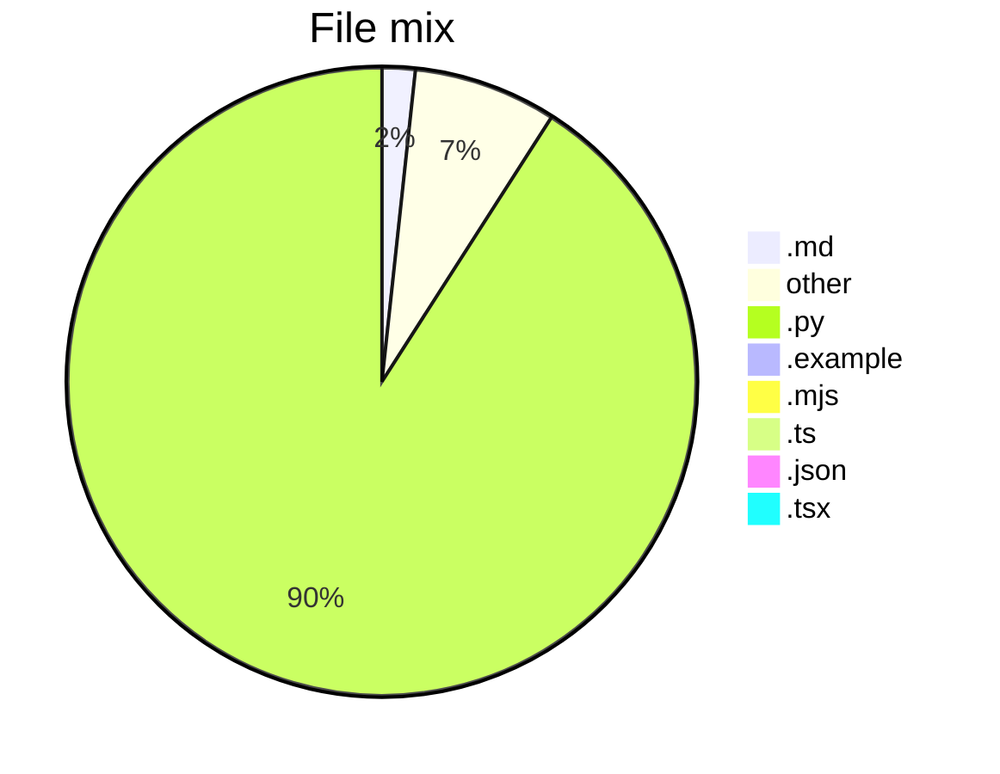

# Project Snapshot

Generated from the repository tree for public maintenance polish.

- `.py`: 4801 files
- `no extension`: 389 files
- `.txt`: 346 files
- `.js`: 221 files
- `.md`: 90 files
- `.yaml`: 84 files
- `.svg`: 74 files
- `.typed`: 64 files
- `.json`: 53 files
- `.png`: 52 files

